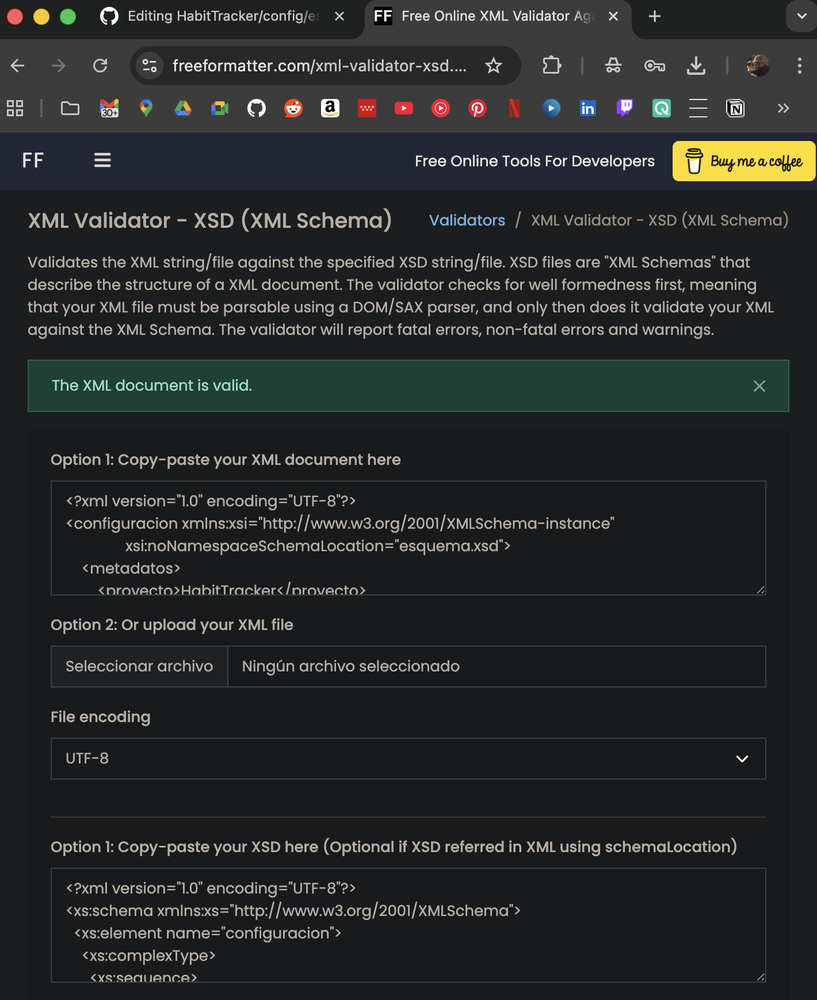
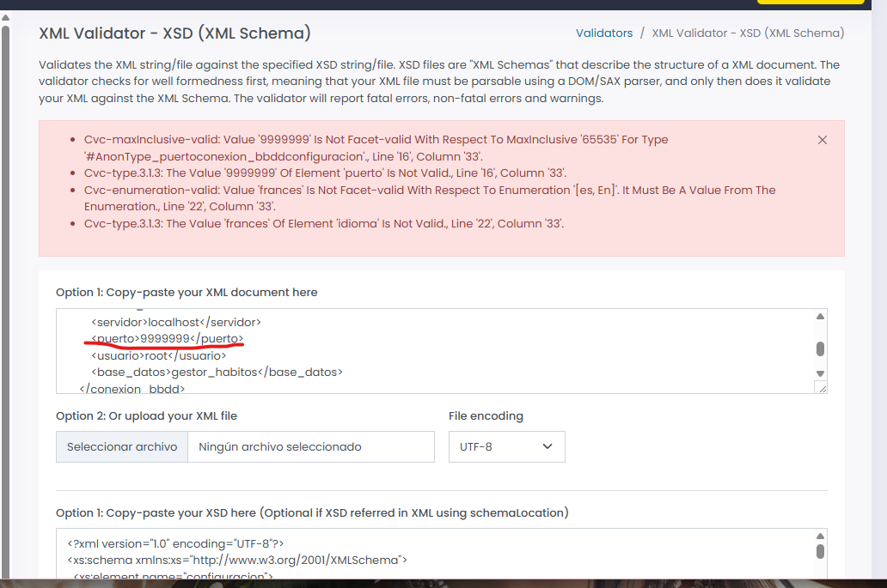

# Documentación: Lenguaje de Marcas

Para este módulo, he aplicado los conocimientos de la asignatura tanto en la documentación técnica como en la configuración lógica del sistema.

## 1. Configuración con XML y XSD
He implementado un sistema de configuración externo que permite desacoplar los parámetros de conexión y preferencias de la lógica de programación en Java.
* **Ubicación:** `/config/configuracion.xml`
* **Validación:** Se ha diseñado un archivo `esquema.xsd` que garantiza la integridad de los datos mediante:
    * **Restricciones numéricas:** El puerto debe estar entre 1 y 65535.
    * **Enumeraciones:** El tema solo acepta los valores `claro` u `oscuro`.
    * **Patrones:** La versión debe seguir el formato decimal (X.X).

## 2. Evidencia de validación
A continuación, se muestra la captura que confirma que el archivo `configuracion.xml` es válido y cumple estrictamente con las reglas definidas en el esquema:

## 3. Control de Errores (Validación Negativa)
Para comprobar la robustez del esquema XSD, se ha realizado una prueba de validación con datos incorrectos (introduciendo un puerto fuera de rango y un idioma no permitido). 

Como se observa en la siguiente captura, el validador detecta automáticamente que el archivo no cumple las reglas de integridad definidas:

