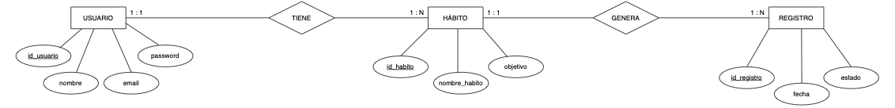
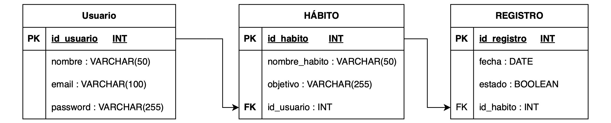

# Diseño de la base de datos

> **Estado:** 100% Integrado con Java mediante JDBC.

## 1. Diseño Conceptual y Lógico
Se ha diseñado la base de datos buscando la máxima eficiencia y evitando la redundancia de datos.

### Diagrama Entidad-Relación (E/R)

### Modelo Relacional

## 2. Implementación Técnica
* **Motor de almacenamiento:** InnoDB (para soportar claves foráneas).
* **Integridad:** Se ha aplicado `ON DELETE CASCADE` para asegurar que al borrar un usuario, se limpien sus hábitos automáticamente.

## 3. Scripts SQL de Entrega
* 📄 [**Script de Creación y Datos**](./gestor_habitos.sql): Contiene el DDL (tablas) y DML (datos de prueba).
* 📄 [**Script de Consultas**](./consultas.sql): Listado de las queries principales utilizadas en la lógica del programa.
